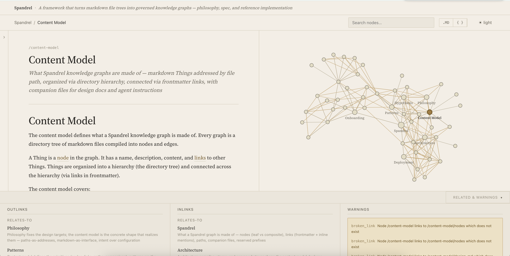
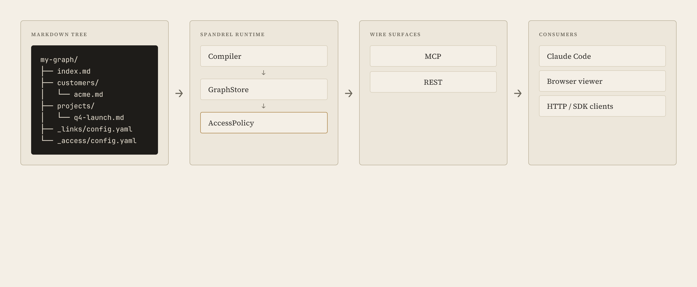

# Spandrel

Spandrel turns your markdown knowledge repo into a high-fidelity context graph served over MCP — built to keep agents faithful to your structure and your domain.

## Why

Coding agents are great for authoring knowledge repos, but they are weak at retrieving knowledge. Grep, glob, and file reads suit code well, but they fare worse on institutional knowledge—rules, decisions, runbooks—where the useful answer rarely matches one obvious search string.

Three problems compound:
- **Brittle retrieval.** Grep finds strings; agents need to navigate concepts.
- **Silent staleness.** Without metadata, no one knows what's load-bearing or out of date.
- **Conflated concerns.** Instructions, knowledge, and skills crammed into the same files reduce reuse and feed hallucination.

## What

Two readings of the same artifact. **Authoring view:** a markdown tree compiles into a typed graph where every Thing has a name, description, and links. **Consumer view:** agents call MCP tools (`context`, `get_node`, `navigate`, `get_references`, `get_graph`) and receive shaped, governed *context packs* — sized to the question, edge types (`owns`, `depends-on`, `relates-to`) as first-class data, access permissions enforced at the wire.

Common shapes that fit naturally into a Spandrel graph: client and account briefs, decision logs, runbooks, playbooks, ICP definitions, skill libraries, team rosters.



*The browser viewer at `localhost:4000` — and at [spandrel.org/content-model/](https://spandrel.org/content-model/) — renders any node as readable markdown plus its typed edges, with a clickable d3-force graph alongside.*

## Architecture



Markdown is the source of truth. The compiler builds a graph in memory; the same `AccessPolicy` instance gates every wire surface; MCP and REST are siblings, not a stack.

## How

A three-layer toolchain produces the artifact above:

- **Compile** — `spandrel compile` or `spandrel dev` turns a markdown tree into a graph. Deterministic, fast, watches for changes.
- **Serve** — REST + MCP through one `AccessPolicy`. Same data, two surfaces, one access contract.
- **Govern** — `_links/config.yaml` (link vocabulary), `_access/config.yaml` (per-path roles), `DESIGN.md` (collection schemas).

## Measure the graph

Spandrel ships with tools to evaluate graph quality, so you can answer *"is this graph good?"* rather than guess.

- **`spandrel audit`** — cheap heuristics flag low-signal descriptions, stub markers, thin bodies, weak edges.
- **`spandrel audit --semantic`** — embeddings surface missing links between concepts that read like neighbors but aren't connected.
- **Task-fidelity harness** (`test/fidelity/`) — runs curated questions through a Claude Code subprocess against your graph's MCP and scores answers with an LLM judge. Measures whether a structural change improved or degraded agent performance on real tasks.

Calibration on our own graphs: a mature graph scored **0.91** baseline on a 10-task set; structural cleanup (filling load-bearing descriptions, restructuring node bodies) moved it to **0.96**. The sample is small and local to that graph — the point is you can run the same harness against yours.

## Try it (hosted)

Before installing anything, point your agent at the live docs MCP — [mcp.spandrel.org](https://mcp.spandrel.org) serves the [spandrel.org](https://spandrel.org) docs graph:

```bash
claude mcp add spandrel https://mcp.spandrel.org/mcp --transport http --scope user
```

Then ask Claude: *"Use the spandrel MCP to orient me — start at `/` and walk me through the philosophy and content model."* You'll see progressive disclosure in action: the agent navigates by following edges, reading descriptions to decide where to go next, loading content only when needed.

## Get started (your own)

Zero to a local MCP endpoint in five steps. For a guided walkthrough of designing a real graph, see [ONBOARDING.md](ONBOARDING.md).

**1. Install.**

```bash
npm install -g spandrel
```

**2. Create a graph.** Scaffolds the root node plus a `_links/config.yaml` seeded with the baseline vocabulary (`owns`, `depends-on`, `relates-to`, …).

```bash
spandrel init my-graph --name "My Graph" --description "Trying Spandrel out."
cd my-graph
```

**3. Add a node.** Create `clients/acme.md`:

```markdown
---
name: Acme Corp
description: Enterprise SaaS client, onboarded Q2 2025.
links:
  - to: /
    type: relates-to
---
Main engagement this quarter.
```

See [docs/patterns/linking.md](docs/patterns/linking.md) for frontmatter vs. inline links.

**4. Compile and serve.** Starts REST + MCP and a visual viewer at `localhost:4000`, plus a file watcher that reloads both on save.

```bash
spandrel dev .
```

Open `localhost:4000` to navigate the graph visually — rendered markdown, clickable d3-force graph, typed relationships, authoring warnings.

**5. Connect Claude Desktop.** Get the MCP snippet:

```bash
spandrel init-mcp .
```

Paste the output into `~/Library/Application Support/Claude/claude_desktop_config.json` and restart Claude Desktop. Ask it to start at `/` and navigate.

## Repo structure

A knowledge repo is pure content — no framework code, no system files:

```
my-knowledge/
├── index.md                  Root — what this graph is about
├── _access/config.yaml       Access control (optional)
├── _links/config.yaml        Link-type vocabulary
├── skills/                   Agent roles (compiled into graph)
│   └── context-engineer/
│       ├── index.md          Discoverable node
│       └── SKILL.md          Operational instructions
├── clients/                  A collection...
│   ├── index.md              Collection description
│   ├── DESIGN.md             What a well-formed member looks like
│   ├── acme-corp.md          Leaf node — a simple Thing
│   └── globex/               Directory node — a Thing with children
│       └── index.md
└── people/
    └── jane.md               Leaf node
```

Two ways to create a Thing: **`foo.md`** (leaf at `/parent/foo`) or **`foo/index.md`** (composite at `/parent/foo`, can have children). If both exist, the directory wins. `DESIGN.md`, `SKILL.md`, `AGENT.md`, and `README.md` are companion files — never compiled as nodes.

## Deployment modes

Three modes, one compiled graph:

- **Local dev** — `spandrel dev` runs REST + MCP + a visual viewer on localhost. The authoring loop.
- **Static + MCP adapter** — `spandrel publish --static` emits a self-contained bundle; a thin serverless function adapts MCP over it. Read-only, hostable anywhere. The recommended production pattern. [mcp.spandrel.org](https://mcp.spandrel.org) is a running example; source at [trevorfox/spandrel-mcp](https://github.com/trevorfox/spandrel-mcp).
- **Live backend** — a Postgres-backed `GraphStore` for graphs that need writes, identity-aware reads, or federation.

Full walkthrough: [docs/deployment/](docs/deployment/).

## Learn more

- [**ONBOARDING.md**](ONBOARDING.md) — agent-guided setup for a new graph
- [**docs/architecture/**](docs/architecture/index.md) — compiler, storage, access policy, REST, MCP
- [**docs/content-model/**](docs/content-model/index.md) — Things, Collections, link types, progressive disclosure
- [**docs/patterns/**](docs/patterns/index.md) — linking conventions, governance, progressive disclosure as a craft
- [**docs/philosophy.md**](docs/philosophy.md) — why a knowledge graph, not a vector store
- [**MCP tool reference**](docs/architecture/mcp.md) — read and write surface
- [**PUBLIC-API.md**](PUBLIC-API.md) — stable npm imports for embedding Spandrel in another TS/JS project

## License

MIT
